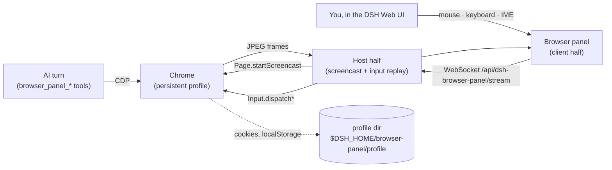

# dsh-browser-panel

**English** | [简体中文](README.zh.md)

A browser that lives inside the DSH host: the AI drives it with `browser_panel_*` tools, and you watch — or take over — the very same tab from a panel in the DSH Web UI.

It exists for one stubborn problem: agents run on machines with no display, but the sites they need are behind a login. A headless browser can be scripted; it cannot scan a QR code, type an SMS code, or solve a CAPTCHA. With this plugin the human does that part **inside the DSH Web UI**, on the same page the AI is already working on, and the resulting session stays in a persistent profile.

## The problem

- An agent host (container, VM, CI box) has no GUI, so it cannot show you a login page.
- Fully headless automation breaks at the first step that needs a person: SSO redirects, one-time passcodes, QR-code logins, CAPTCHAs, hardware keys.
- Copying cookies or `storageState` into the container is fragile: device-bound credentials, fingerprints, and WebAuthn simply do not transfer.

## What it does

**One browser, two control planes.** The AI speaks CDP; the human speaks the panel. Both act on the same tab, and the login the human performs is exactly the session the AI keeps using.

| Capability | Tool | Notes |
|---|---|---|
| Report state | `browser_panel_status` | Running? Which URL/title? Is a human action pending? |
| Open a URL | `browser_panel_navigate` | Starts the browser on first use; `newTab` keeps the current page |
| Read the page | `browser_panel_snapshot` | Title, URL, numbered inventory of clickable/typable elements, visible text |
| Click | `browser_panel_click` | By element number or by visible text; real input events |
| Fill a field | `browser_panel_type` | React/Vue-friendly insertion; `submit` presses Enter |
| Press a key | `browser_panel_press` | Enter, Tab, Escape, arrows, PageUp/Down, … |
| Scroll | `browser_panel_scroll` | down/up/left/right/top/bottom |
| Look at the page | `browser_panel_screenshot` | PNG returned to the model as an image attachment |
| **Ask the human** | `browser_panel_ask_human` | Opens the panel with your instruction and **waits** until they press 完成 |
| Stop the browser | `browser_panel_close` | Frees memory; the profile (and every login) stays |

Panel side (DSH Web UI):

- a sidebar entry that opens the live view of the container browser;
- the canvas accepts your mouse, wheel, keyboard and IME input — it is not a screenshot viewer, the events are replayed into the same CDP session the AI uses;
- a hand-over banner appears when the AI calls `browser_panel_ask_human`, with a 我已完成 / Done button that resumes the waiting tool call;
- back / forward / reload / repaint controls in the toolbar.

## How it works



- The host half launches one Chrome per DSH host process. With `mode: auto` it runs **headed on a private Xvfb** when Xvfb is available (better fingerprint than headless) and falls back to `--headless=new` otherwise.
- The panel is served by the host webserver, on the same origin and behind **the same session authentication as the Web UI itself** (`connection.requestRejection`). No extra port, no extra token, no tunnel.
- Frames travel as JPEG over one WebSocket; input travels back as small JSON messages. Frames are dropped rather than queued when your connection falls behind.
- Nothing is written into DSH core: the plugin is one composition row.

## Requirements

- DSH `>= 0.1.5-rc.2`, Node `>= 22.19`.
- A Chromium-family browser. Auto-detected in this order: `browserPath` config → `google-chrome-stable` / `google-chrome` / `chromium` / `chromium-browser` / `chrome` on `PATH` → Playwright cache (`~/.cache/ms-playwright/chromium-*/…`) → Puppeteer cache.
- Optional: `Xvfb` on `PATH` for headed mode. Without it the plugin runs headless automatically.

## Install

```sh
# npm
dsh plugin --profile web add dsh-browser-panel

# straight from GitHub
dsh plugin --profile web add github:imroc/dsh-browser-panel
```

The package ships its built JavaScript, so nothing is compiled on install.

Restart the Web UI afterwards (adding a plugin row is a boot-time composition change):

```sh
systemctl --user restart dsh-web      # or however you run `dsh web`
```

## Verify

1. Open the DSH Web UI. A **Browser** entry appears in the sidebar; click it.
2. The panel opens and the browser starts on demand — the first frame is the container's own Chrome.
3. Type a URL in the AI conversation and ask it to open it; the page appears in the same panel:

   ```
   Use browser_panel_navigate to open https://example.com, then browser_panel_snapshot.
   ```

4. Ask the AI to hand over, then complete the login yourself in the panel:

   ```
   Call browser_panel_ask_human with the instruction "请在面板里完成登录，然后点我已完成".
   ```

5. Log in, press **我已完成** — the tool call returns, and the AI continues with an authenticated session.
6. Restart the browser (`browser_panel_close`, then any other tool call): you are still logged in, because the profile persists.

## Configuration

Override any field from your own patch layer (`~/.dsh/cordis.patch.yml`, or the profile's `cordis.patch.yml`). The whole `config` key is replaced, so restate what you need:

```yaml
- id: browser-panel
  config:
    mode: headless            # auto | headed | headless
    viewport: 1280x800
    idleShutdownMinutes: 30
```

| Key | Default | Meaning |
|---|---|---|
| `browserPath` | `''` | Explicit Chrome/Chromium path; empty = auto-detect. |
| `profileDir` | `''` | Persistent profile; empty = `$DSH_HOME/browser-panel/profile`. |
| `mode` | `auto` | `auto` = headed on a private Xvfb when available, else headless. |
| `screen` | `1440x900x24` | Geometry of the private Xvfb. |
| `windowSize` | `1440x900` | Chrome window size in headed mode. |
| `viewport` | `1440x900` | Emulated page viewport — also the panel canvas coordinate space. |
| `xvfbDisplay` | `:99` | Preferred X display; the next free one is used if taken. |
| `port` | `0` | Fixed DevTools port; `0` picks a free one. |
| `startUrl` | `about:blank` | First URL of a fresh browser. |
| `extraArgs` | `[]` | Extra Chrome switches. |
| `snapshotMaxChars` | `4000` | Page text budget per snapshot. |
| `maxElements` | `80` | Interactive elements listed per snapshot. |
| `screencastQuality` | `60` | JPEG quality of the stream. |
| `screencastMaxWidth` | `1440` | Maximum streamed frame width. |
| `askHumanTimeoutSeconds` | `600` | Default budget of `browser_panel_ask_human`. |
| `idleShutdownMinutes` | `0` | Stop the browser after this much idle time; `0` never stops it. |
| `autoStart` | `false` | Start the browser with the host instead of on first use. |
| `startTimeoutMs` | `20000` | How long to wait for the DevTools endpoint after launch. |

## Security notes

- The panel and its WebSocket live behind the **same authentication as the DSH Web UI**. Anyone who can see the panel can already drive the container's browser — treat Web UI access accordingly.
- The browser profile holds real sessions. It stays on the host (`0700`-owned home directory), is never uploaded, and is not part of the Git repository.
- Browser traffic goes out from the container. A data-centre IP is a weaker signal than your laptop's; for sites that are aggressive about automation, `mode: headed` (the default) is the better half of the trade.
- Prefer running Chrome as a non-root user with the sandbox on; the plugin only adds `--no-sandbox` automatically when the host process runs as root.

## Rollback

```sh
dsh plugin --profile web remove dsh-browser-panel   # or delete the row from cordis.patch.yml
```

Then restart the Web UI. The profile directory is left in place, so reinstalling keeps your logins. Delete `$DSH_HOME/browser-panel/profile` to forget them.

## License

MIT
