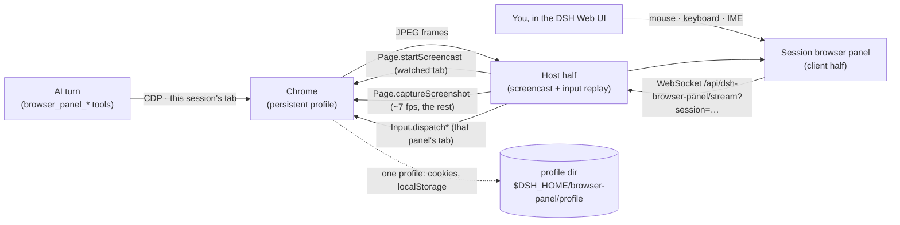

# dsh-browser-panel

**English** | [简体中文](README.zh.md)

A browser that lives inside the DSH host: every DSH session gets **its own tab** in it, the AI drives that tab with `browser_panel_*` tools, and you watch — or take over — the very same tab from a panel in the session page of the DSH Web UI.

It exists for one stubborn problem: agents run on machines with no display, but the sites they need are behind a login. A headless browser can be scripted; it cannot scan a QR code, type an SMS code, or solve a CAPTCHA. With this plugin the human does that part **inside the DSH Web UI**, on the same tab the AI is already working on, and the result stays in a persistent profile — so a login performed once works in every session, now and after a restart.

## The problem

- An agent host (container, VM, CI box) has no GUI, so it cannot show you a login page.
- Fully headless automation breaks at the first step that needs a person: SSO redirects, one-time passcodes, QR-code logins, CAPTCHAs, hardware keys.
- Copying cookies or `storageState` into the container is fragile: device-bound credentials, fingerprints, and WebAuthn simply do not transfer.

## What it does

**One browser, one tab per session, two control planes.** The AI speaks CDP on its own tab; the human speaks the panel on that same tab. The login the human performs is exactly the session the AI keeps using — and because all sessions share one profile, every other session is logged in too.

| Capability | Tool | Notes |
|---|---|---|
| Report state | `browser_panel_status` | Running? Which URL/title has *this session's* tab? Is a human action pending? |
| Open a URL | `browser_panel_navigate` | Starts the browser on first use; `newTab` replaces this session's page with a fresh tab |
| Read the page | `browser_panel_snapshot` | Title, URL, numbered inventory of clickable/typable elements, visible text |
| Click | `browser_panel_click` | By element number or by visible text; real input events |
| Fill a field | `browser_panel_type` | React/Vue-friendly insertion; `submit` presses Enter |
| Press a key | `browser_panel_press` | Enter, Tab, Escape, arrows, PageUp/Down, … |
| Scroll | `browser_panel_scroll` | down/up/left/right/top/bottom |
| Look at the page | `browser_panel_screenshot` | PNG returned to the model as an image attachment |
| **Ask the human** | `browser_panel_ask_human` | Opens *this session's* panel with your instruction and **waits** until they press 我已完成 |
| Close the tab | `browser_panel_close` | Closes this session's tab; the profile (and every login) stays |

Panel side (DSH Web UI):

- a **浏览器 / Browser** tab in the session's view strip — the live view of *that* session's tab; every session shows its own;
- the sidebar entry (browser glyph) is the host-wide **overview**: one row per session tab — title, URL, last used, a 待接管 badge while that session waits for a person, and 结束并清理 on each row;
- the canvas accepts your mouse, wheel, keyboard and IME input — it is not a screenshot viewer, the events are replayed into the very CDP session the AI uses;
- the hand-over banner appears in the panel of **the session that asked**, with a 我已完成 / Done button that resumes the waiting tool call (and an optional note back to the AI);
- a toolbar with back / forward / reload / repaint, Tab / ⇧Tab / Enter to walk a form without aiming the mouse, and 结束并清理.

## How it works



- The host half launches one Chrome per DSH host process. With `mode: auto` it runs **headed on a private Xvfb** when Xvfb is available (better fingerprint than headless) and falls back to `--headless=new` otherwise.
- A session's tab is created **lazily** — on that session's first `browser_panel_*` call, or when the human opens the browser from that session's panel — and closed when the session is disposed, when the AI calls `browser_panel_close`, or when the human presses 结束并清理. Sessions are isolated in *page state*, not in identity: they share the profile, so a login performed once is available everywhere.
- Every tab is **activated once** when it is created. A Chrome target that was never activated silently discards every injected input event for the rest of its life, and one activation repairs it permanently. Afterwards a session's tab accepts input even while it is in the background — so the AI never moves your foreground.
- Chrome only emits screencast frames for the **active tab**. The panel you are actually looking at sends `focus` and owns the real `Page.startScreencast`; every other attached session is served by polled `Page.captureScreenshot` frames (~7 fps target; its first frame can be cold — seconds — while another tab owns the screencast). A freshly opened panel always gets a seeded frame, because a static page emits none on its own.
- Tools carry no session parameter: every handler reads the session id from its own execution context (`exec.agent.id`), so tool names and parameters stay small and a session can never steer another session's tab. A call with no owning session is an error.
- The panel is served by the host webserver, on the same origin and behind **the same session authentication as the Web UI itself** (`connection.requestRejection`). Every route carries a session id: `GET /api/dsh-browser-panel/state?session=…`, `GET /sessions`, `POST /open|/close|/human-done`, `GET /health`, and the `/stream?session=…` WebSocket upgrade. No extra port, no extra token, no tunnel.
- Human take-over is per session: two sessions can wait on a human at the same time, and a request is delivered only to the panel of its own session.
- Frames travel as JPEG over one WebSocket; input travels back as small JSON messages. Frames are dropped rather than queued when your connection falls behind.
- Nothing is written into DSH core: the plugin is one composition row.
- The measured constraints behind these choices are written down in [`references/PITFALLS.md`](references/PITFALLS.md) (#11–#13).

## Requirements

- DSH `>= 0.1.5-rc.2`, Node `>= 22.19`.
- A Chromium-family browser. Auto-detected in this order: `browserPath` config → `google-chrome-stable` / `google-chrome` / `chromium` / `chromium-browser` / `chrome` on `PATH` → Playwright cache (`~/.cache/ms-playwright/chromium-*/…`) → Puppeteer cache.
- Optional: `Xvfb` on `PATH` for headed mode. Without it the plugin runs headless automatically.

## Install

Version **0.2.0**. This release is deliberately breaking: the plugin used to own one shared page for the whole host, and there is no shared-browser mode any more — 0.2.0 gives every session its own tab. 0.1.x is the previous, single-page release.

```sh
# npm
dsh plugin --profile web add dsh-browser-panel

# straight from GitHub
dsh plugin --profile web add github:imroc/dsh-browser-panel
```

If your registry still resolves an 0.1.x build, ask for the version explicitly (`dsh-browser-panel@0.2.0`) or install straight from GitHub.

The package ships its built JavaScript, so nothing is compiled on install.

Restart the Web UI afterwards (adding a plugin row is a boot-time composition change):

```sh
systemctl --user restart dsh-web      # or however you run `dsh web`
```

## Verify

1. Open the DSH Web UI. A **浏览器 / Browser** tab appears in the session's view strip — click it. The sidebar also gains a browser entry, which lists the tabs of every session.
2. The tab reports that this session has no browser open yet, with a button to open one; the browser starts on demand (any `browser_panel_*` call opens it too), and the first frame is this session's own tab in the host Chrome.
3. Type a URL in the AI conversation and ask it to open it; the page appears in that same tab:

   ```
   Use browser_panel_navigate to open https://example.com, then browser_panel_snapshot.
   ```

4. Ask the AI to hand over, then complete the login yourself in the panel:

   ```
   Call browser_panel_ask_human with the instruction "请在面板里完成登录，然后点我已完成".
   ```

5. Log in, press **我已完成** — the tool call returns, and the AI continues with an authenticated session.
6. In a second session, open its own browser tab: it is a *different* tab, but it is already logged in, because the profile is shared. Close one session's tab (`browser_panel_close`, or 结束并清理) and reopen it: still logged in.

## Configuration

Override any field from your own patch layer (`~/.dsh/cordis.patch.yml`, or the profile's `cordis.patch.yml`). The whole `config` key is replaced, so restate what you need:

```yaml
- id: browser-panel
  config:
    mode: headless            # auto | headed | headless
    viewport: 1280x800
    idleShutdownMinutes: 30
```

| Key | Default | Meaning |
|---|---|---|
| `browserPath` | `''` | Explicit Chrome/Chromium path; empty = auto-detect. |
| `profileDir` | `''` | Persistent profile; empty = `$DSH_HOME/browser-panel/profile`. Shared by every session. |
| `mode` | `auto` | `auto` = headed on a private Xvfb when available, else headless. |
| `screen` | `1440x900x24` | Geometry of the private Xvfb. |
| `windowSize` | `1440x900` | Chrome window size in headed mode. |
| `viewport` | `1440x900` | Emulated page viewport — the same for every session tab, and the panel canvas coordinate space. |
| `xvfbDisplay` | `:99` | Preferred X display; the next free one is used if taken. |
| `port` | `0` | Fixed DevTools port; `0` picks a free one. |
| `startUrl` | `about:blank` | First URL of each session's fresh tab. |
| `extraArgs` | `[]` | Extra Chrome switches. |
| `snapshotMaxChars` | `4000` | Page text budget per snapshot. |
| `maxElements` | `80` | Interactive elements listed per snapshot. |
| `screencastQuality` | `60` | JPEG quality of the stream (and of the polled stills). |
| `screencastMaxWidth` | `1440` | Maximum streamed frame width. |
| `pollFrameMs` | `140` | Poll interval for panels that cannot own the foreground screencast (~7 fps). Values below `60` are clamped. |
| `askHumanTimeoutSeconds` | `600` | Default budget of `browser_panel_ask_human`. |
| `idleShutdownMinutes` | `0` | Stop the browser — and with it every session's tab — after this much idle time; `0` never stops it. |
| `autoStart` | `false` | Start the browser with the host instead of on first use. |
| `startTimeoutMs` | `20000` | How long to wait for the DevTools endpoint after launch. |

## Security notes

- The panel and its WebSocket live behind the **same authentication as the DSH Web UI**. Anyone who can see the panel can already drive the host browser — treat Web UI access accordingly.
- Sessions are isolated in page state, **not** in identity: every session uses the same browser profile, and therefore the same cookies and logins. That is the point of the plugin, but it also means one session's AI can reach any site the profile is logged into.
- The browser profile holds real sessions. It stays on the host, under the DSH home, is never uploaded, and is not part of the Git repository.
- Browser traffic goes out from the container. A data-centre IP is a weaker signal than your laptop's; for sites that are aggressive about automation, `mode: headed` (the default whenever Xvfb is available) is the better half of the trade.
- Prefer running Chrome as a non-root user with the sandbox on; the plugin only adds `--no-sandbox` automatically when the host process runs as root.

## Rollback

```sh
dsh plugin --profile web remove dsh-browser-panel   # or delete the row from cordis.patch.yml
```

Then restart the Web UI. The profile directory is left in place, so reinstalling keeps your logins. Delete `$DSH_HOME/browser-panel/profile` to forget them.

## License

MIT
