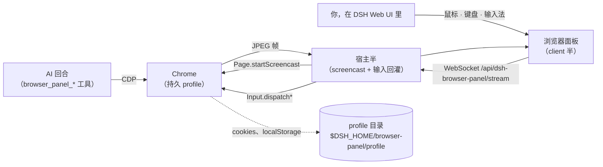

# dsh-browser-panel

[English](README.md) | **简体中文**

一个住在 DSH 宿主里的浏览器：AI 用 `browser_panel_*` 工具驱动它，而你在 DSH Web UI 的面板里看**同一个标签页**，随时可以接手。

它为一个顽固的问题而生：agent 跑在**没有显示器**的机器上，而它要用的站点都在登录后面。无头浏览器可以被脚本驱动，但它扫不了二维码、收不了短信验证码、过不了人机校验。有了这个插件，这些环节由**你在 DSH Web UI 里**完成，而且就在 AI 正在操作的那个页面上；登录结果落进持久 profile，AI 之后一直免登录使用。

## 要解决的问题

- agent 宿主（容器、虚机、CI 机器）没有 GUI，无法把登录页展示给人看。
- 纯无头自动化会在"需要真人"的第一步卡死：SSO 跳转、一次性验证码、扫码登录、图形验证码、硬件密钥。
- 把 cookie / `storageState` 搬进容器很脆：设备绑定凭据（DBSC）、指纹、WebAuthn 都搬不过去。

## 能力

**一个浏览器，两个控制面**：AI 走 CDP，人类走面板，作用于同一个标签页——人类登录出来的会话，正是 AI 继续使用的会话。

| 能力 | 工具 | 说明 |
|---|---|---|
| 查状态 | `browser_panel_status` | 是否在运行、当前 URL/标题、有没有待人类处理的动作 |
| 打开网址 | `browser_panel_navigate` | 首次调用即启动浏览器；`newTab` 可保留当前页 |
| 读页面 | `browser_panel_snapshot` | 标题、URL、带编号的可交互元素清单、可见正文 |
| 点击 | `browser_panel_click` | 按元素编号或可见文字；派发真实输入事件 |
| 填字段 | `browser_panel_type` | 兼容 React/Vue 受控输入；`submit` 顺带回车 |
| 按键 | `browser_panel_press` | Enter、Tab、Escape、方向键、PageUp/Down 等 |
| 滚动 | `browser_panel_scroll` | down/up/left/right/top/bottom |
| 看渲染 | `browser_panel_screenshot` | PNG 以图片附件形式返回给模型 |
| **请人帮忙** | `browser_panel_ask_human` | 带你的说明打开面板，并**等待**人类点「我已完成」 |
| 关浏览器 | `browser_panel_close` | 释放内存；profile（含所有登录态）保留 |

面板侧（DSH Web UI）：

- 侧边栏一个「浏览器」入口，点开就是容器浏览器的实时画面；
- 画布接受真实鼠标、滚轮、键盘与输入法事件——它不是截图查看器，事件会被回灌进 AI 正在用的那个 CDP 会话；
- AI 调用 `browser_panel_ask_human` 时弹出接管横幅，点「我已完成」即让等待中的工具调用返回；
- 工具栏有后退/前进/刷新/重绘。

## 工作原理



- 宿主半为每个 DSH 宿主进程启动一个 Chrome。`mode: auto` 下若有 Xvfb 就在**私有 Xvfb 上跑 headed**（指纹比 headless 好），否则自动退回 `--headless=new`。
- 面板由宿主 webserver 提供，与 Web UI **同源、同一套会话认证**（`connection.requestRejection`）。不需要额外端口、额外 token 或隧道。
- 画面以 JPEG 走一条 WebSocket，输入以小 JSON 消息回传；连接跟不上时**丢帧而不是排队**。
- 不往 DSH 核心里写任何东西：插件就是组合树里的一行。

## 环境要求

- DSH `>= 0.1.5-rc.2`，Node `>= 22.19`。
- 一个 Chromium 系浏览器。自动探测顺序：`browserPath` 配置 → `PATH` 上的 `google-chrome-stable` / `google-chrome` / `chromium` / `chromium-browser` / `chrome` → Playwright 缓存（`~/.cache/ms-playwright/chromium-*/…`）→ Puppeteer 缓存。
- 可选：headed 模式需要 `PATH` 上有 `Xvfb`；没有就自动用 headless。

## 安装

```sh
# npm
dsh plugin --profile web add dsh-browser-panel

# 直接从 GitHub
dsh plugin --profile web add github:imroc/dsh-browser-panel
```

装完需要重启 Web UI（新增插件行属于启动期组合变更）：

```sh
systemctl --user restart dsh-web      # 或你启动 `dsh web` 的方式
```

## 验证

1. 打开 DSH Web UI，侧边栏出现 **浏览器** 入口，点它。
2. 面板打开并按需启动浏览器——第一帧就是容器里那台 Chrome 的画面。
3. 在对话里让 AI 打开一个网址，页面会出现在同一个面板里：

   ```
   用 browser_panel_navigate 打开 https://example.com，然后 browser_panel_snapshot。
   ```

4. 让 AI 把控制权交给你，然后你自己在面板里完成登录：

   ```
   调用 browser_panel_ask_human，说明写「请在面板里完成登录，然后点我已完成」。
   ```

5. 登录完成点 **我已完成** —— 工具调用返回，AI 带着已登录的会话继续往下做。
6. 关掉再打开（`browser_panel_close` 后再随便调一次工具）：**仍然是登录态**，因为 profile 是持久的。

## 配置

在你自己的 patch 层里覆盖任意字段（`~/.dsh/cordis.patch.yml` 或 profile 的 `cordis.patch.yml`）。`config` 是整键替换，需要什么就写全：

```yaml
- id: browser-panel
  config:
    mode: headless            # auto | headed | headless
    viewport: 1280x800
    idleShutdownMinutes: 30
```

| 字段 | 默认 | 含义 |
|---|---|---|
| `browserPath` | `''` | 显式指定 Chrome/Chromium 路径；空 = 自动探测。 |
| `profileDir` | `''` | 持久 profile；空 = `$DSH_HOME/browser-panel/profile`。 |
| `mode` | `auto` | `auto` = 有 Xvfb 时 headed，否则 headless。 |
| `screen` | `1440x900x24` | 私有 Xvfb 的分辨率。 |
| `windowSize` | `1440x900` | headed 模式的窗口尺寸。 |
| `viewport` | `1440x900` | 模拟的页面视口，也是面板画布的坐标空间。 |
| `xvfbDisplay` | `:99` | 首选 X display；被占用则顺延。 |
| `port` | `0` | 固定 DevTools 端口；`0` 表示自动挑空闲端口。 |
| `startUrl` | `about:blank` | 新浏览器的首个地址。 |
| `extraArgs` | `[]` | 额外的 Chrome 启动参数。 |
| `snapshotMaxChars` | `4000` | 每次快照的正文预算。 |
| `maxElements` | `80` | 每次快照列出的可交互元素上限。 |
| `screencastQuality` | `60` | 推流 JPEG 质量。 |
| `screencastMaxWidth` | `1440` | 推流画面的最大宽度。 |
| `askHumanTimeoutSeconds` | `600` | `browser_panel_ask_human` 的默认等待预算。 |
| `idleShutdownMinutes` | `0` | 空闲多久后关闭浏览器；`0` 表示从不关。 |
| `autoStart` | `false` | 随宿主启动浏览器，而不是等第一次调用。 |
| `startTimeoutMs` | `20000` | 启动后等待 DevTools 端点的上限。 |

## 安全须知

- 面板及其 WebSocket 与 DSH Web UI **同一套认证**。能看到面板的人，本来就能操作容器里的浏览器——请按这个标准看待 Web UI 的访问控制。
- profile 里是真实会话。它只留在宿主上（属主 `0700` 的家目录），不会上传，也不在 Git 仓库里。
- 浏览器流量从容器出去。数据中心 IP 比你的笔记本更"像机器人"；对付严格的站点，`mode: headed`（默认值）是这点上更划算的一半。
- 尽量用非 root 用户跑 Chrome 并保留沙箱；插件只在宿主进程是 root 时才自动补 `--no-sandbox`。

## 回退

```sh
dsh plugin --profile web remove dsh-browser-panel   # 或直接从 cordis.patch.yml 删掉那一行
```

然后重启 Web UI。profile 目录会保留，所以重装后登录态还在；想彻底忘掉就删 `$DSH_HOME/browser-panel/profile`。

## License

MIT
